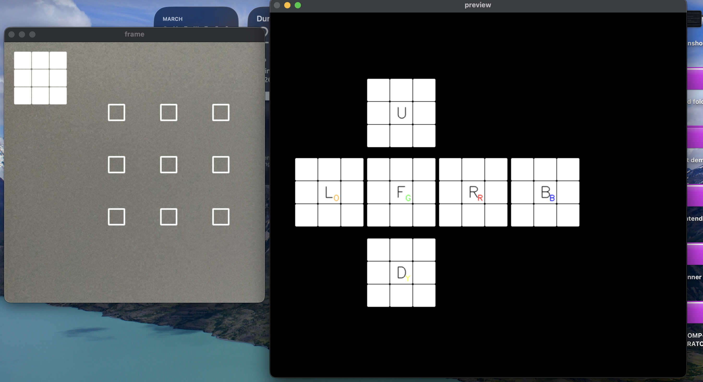

<div align="center">

# 🎲 CubeVision

> 🎯 Real-time Rubik’s Cube solver using Computer Vision, achieving **~90% color detection accuracy** and computing optimal solutions (**≤20 moves**) via the Kociemba two-phase algorithm.

[](https://www.python.org/)
[](https://opencv.org/)
[](https://numpy.org/)
[](#)

</div>

---
## 🚀 Demo

🔗 https://drive.google.com/file/d/1e1Jehq7A7n3eJeUhSfEsecYDBnvVKpFK/view?usp=drive_link

---

## 📸 Preview

<p align="center">
  
</p>

---

## ⚡ Highlights

- 🎥 Real-time cube detection via webcam (OpenCV)
- 🎯 ~90% color classification accuracy using HSV color space
- 🧠 Optimal solving using Kociemba algorithm (≤20 moves)
- ⚡ End-to-end pipeline: **scan → compute → visualize**
- 🖥️ Interactive GUI with alignment guides and playback

---

## 📌 Overview

Solving a Rubik's Cube manually requires memorizing numerous algorithms. This project automates the entire process by combining **Computer Vision** and **algorithmic optimization**.

The system captures cube faces via webcam, detects colors using OpenCV, converts them into a valid cube state, and computes an optimal solution using the **Kociemba Two-Phase Algorithm**. It then visually guides the user step-by-step to solve the cube.

---

## 🧠 Challenges Solved

- Handling lighting variations using HSV color space instead of RGB  
- Accurate facelet detection via contour filtering and geometric constraints  
- Mapping detected colors → valid cube state representation  
- Integrating real-time vision pipeline with solver algorithm  
- Providing intuitive visual guidance for physical cube manipulation  

---

## ✨ Key Features

- **Real-Time Video Processing**: Captures and processes live webcam feed  
- **Robust Color Detection**: HSV-based segmentation for lighting invariance  
- **Interactive GUI**: Alignment guides for precise scanning  
- **Optimal Path Computation**: Kociemba algorithm for efficient solutions  
- **Step-by-Step Visualization**: Animated solving instructions  
- **Modular Architecture**: Clean separation of vision, logic, and UI layers  

---

## 🛠️ Technology Stack

- **Python** — Core application logic  
- **OpenCV (`cv2`)** — Image processing & computer vision  
- **NumPy** — Efficient matrix operations  
- **Kociemba** — Two-phase optimal solving algorithm  
- **Colorama** — CLI styling  

---

## 📊 Performance

| Metric | Value |
|------|------|
| Color Detection Accuracy | ~90% |
| Solve Length | ≤20 moves |
| Processing | Real-time (webcam-based) |
| Pipeline | End-to-end automated |

---

## 🏗️ System Pipeline

```text
Webcam Input → OpenCV Processing → HSV Color Detection → Cube State Encoding → Kociemba Solver → Visualization

```


## 🚀 Getting Started

Follow these steps to set up the project on your local machine.

### Prerequisites

You need Python 3 installed on your system. It's recommended to run this within a virtual environment.

### Installation

1. **Clone the repository** (if you haven't already):
   ```bash
   git clone https://github.com/SUPAM07/cubeVision.git
   cd cubeVision
   ```

2. **Create a virtual environment**:
   ```bash
   python -m venv my_project_env
   source my_project_env/bin/activate  # On Windows use: my_project_env\Scripts\activate
   ```

3. **Install the required dependencies**:
   ```bash
   pip install opencv-python numpy kociemba colorama
   ```

## 🎮 How to Use

1. **Launch the Application**:
   ```bash
   python main.py
   ```

2. **Scan the Cube Faces**:
   Hold your physical Rubik's Cube up to the webcam, aligning its side within the central bounding boxes shown on the screen. Press the corresponding key on your keyboard to register that face.
   
   **Keyboard Controls:**
   - `u` : Scan **Up** face
   - `d` : Scan **Down** face
   - `f` : Scan **Front** face
   - `b` : Scan **Back** face
   - `l` : Scan **Left** face
   - `r` : Scan **Right** face
   
   > *Tip: Keep an eye on the preview window to see which sides you've scanned and ensure the center color is correctly mapped!*

3. **Calculate Solution**:
   Once all 6 faces are successfully scanned, press **`Enter`** to calculate the solution.
   
4. **Follow the Steps**:
   The application will output the steps (e.g., `U`, `R'`, `F2`) and provide a visual playback of the required moves to solve the cube.

5. **Exit Application**:
   Press **`Esc`** at any time to close the program.

## 📂 Project Structure

```text
├── main.py                # Application entry point and main event loop
├── config.py              # Configuration and global variables
├── core.py                # Core application logic 
├── cube_logic.py          # State translations and solver abstractions
├── hsv_calibration.py     # Module for calibrating HSV bounds for your webcam/lighting
├── solver_visualizer.py   # Graphics handling for the step-by-step solution viewing
├── vision_utils.py        # Helper functions for OpenCV processing
└── README.md              # Project documentation

```
## 🤝 Acknowledgments

- [Herbert Kociemba](http://kociemba.org/cube.htm) for the brilliant Two-Phase Algorithm.
- The open-source communities behind OpenCV and Python.
